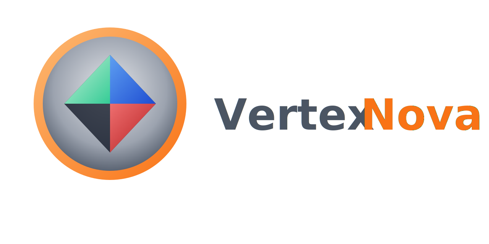

# VertexNova Math

<p align="center">
  
</p>

<p align="center">
  <strong>A high-performance, cross-platform C++ math library for game engines and 3D applications</strong>
</p>

<p align="center">
  <a href="https://github.com/vertexnova/vnemath/actions/workflows/ci.yml">
    
  </a>
  <a href="https://codecov.io/gh/vertexnova/vnemath">
    
  </a>
  
  
</p>

---

## About

**VertexNova Math** (vnemath) is a comprehensive math library designed for real-time graphics applications, game engines, and 3D tools. It provides templated vector, matrix, and quaternion types along with a rich set of geometry primitives, intersection tests, and procedural generation utilities.

This library is part of [VertexNova](https://github.com/vertexnova) — a multi-backend game/graphics engine built from scratch.

## Features

### Core Types
- **Vectors**: `Vec2f`, `Vec3f`, `Vec4f` (and double/int variants)
- **Matrices**: `Mat2f`, `Mat3f`, `Mat4f` with full transformation support
- **Quaternions**: `Quatf`, `Quatd` for rotation representation
- **Color**: RGBA color with HSV/HSL conversions and gamma correction

### Geometry Primitives
- **Basic**: Ray, Plane, Line, LineSegment, Rect
- **Bounding Volumes**: AABB, Sphere, OBB (Oriented Bounding Box), Capsule
- **Complex**: Triangle, Frustum

### Intersection Testing
- Ray-Plane, Ray-Sphere, Ray-AABB, Ray-Triangle (Möller–Trumbore)
- Frustum culling for visibility determination
- Fast boolean intersection tests for culling

### Interpolation & Animation
- **Easing Functions**: smoothstep, smootherstep, and 30+ easing curves
- **Bezier Curves**: Quadratic, Cubic with derivatives and arc length
- **Splines**: Catmull-Rom (passes through points), Hermite (tangent control), B-spline
- **Spring Physics**: Critical damping and exponential decay

### Procedural Generation
- **Perlin Noise**: 1D, 2D, 3D gradient noise
- **Simplex Noise**: Faster, fewer artifacts
- **Fractal Brownian Motion**: Multi-octave layered noise
- **Turbulence & Ridged Noise**: For fire, smoke, mountains

### Coordinate Spaces
- **Projection Utilities**: project, unproject, screenToWorldRay
- **Transform Decomposition**: Extract TRS from matrices, smooth interpolation
- **Multi-Backend Support**: OpenGL, Vulkan, Metal, DirectX, WebGPU

### Utilities
- Angle normalization and interpolation (with wraparound handling)
- Random number generation (Mersenne Twister based)
- GPU-aligned types for shader uniform buffers
- Statistics (running mean, variance, standard deviation)

## Architecture: GLM Integration & Matrix Conventions

### GLM as Compute Backend

VertexNova Math uses [GLM](https://github.com/g-truc/glm) (OpenGL Mathematics) as the optimized backend for expensive matrix operations while providing its own API layer:

```
┌─────────────────────────────────────────────────────────────┐
│                    VertexNova Math API                       │
│  Vec<T,N>, Mat<T,R,C>, Quatf, Color, geometry primitives    │
├─────────────────────────────────────────────────────────────┤
│                     GLM Backend                              │
│  Optimized: inverse, determinant, perspective, lookAt, etc. │
└─────────────────────────────────────────────────────────────┘
```

**GLM is used for:**
- Matrix inverse, determinant, inverse-transpose
- Projection matrices (perspective, orthographic)
- View matrices (lookAt)
- Transform matrices (translate, rotate, scale)
- SIMD-optimized operations where available

**VertexNova Math provides:**
- Unified type system with seamless GLM conversion
- Multi-backend graphics API support
- Geometry primitives and intersection tests
- Easing, curves, noise, and other utilities
- C++20 concepts and modern API design

### Seamless GLM Interop

```cpp
#include <vertexnova/math/core/core.h>
#include <glm/glm.hpp>

using namespace vne::math;

// Automatic conversion both ways
Mat4f vne_matrix = Mat4f::translate(Vec3f(1, 2, 3));
glm::mat4 glm_matrix = vne_matrix;  // Implicit conversion to GLM
Mat4f back = glm_matrix;             // Implicit conversion from GLM

// Same for vectors
Vec3f vne_vec(1, 2, 3);
glm::vec3 glm_vec = static_cast<glm::vec3>(vne_vec);
```

### Matrix Storage: Column-Major

VertexNova Math uses **column-major storage** (same as GLM, OpenGL, and Vulkan):

```cpp
// Mat4f internal layout:
// columns[0] = first column  (X-axis / right vector)
// columns[1] = second column (Y-axis / up vector)
// columns[2] = third column  (Z-axis / forward vector)
// columns[3] = fourth column (translation / position)

Mat4f transform = Mat4f::translate(Vec3f(10, 20, 30));

// Access translation (4th column)
Vec3f position = transform.getColumn(3).xyz();  // (10, 20, 30)
Vec3f position2 = transform.translation();       // Same, convenience method

// Access basis vectors
Vec3f right = transform.xAxis();    // Column 0
Vec3f up = transform.yAxis();       // Column 1
Vec3f forward = transform.zAxis();  // Column 2
```

**Memory layout** (16 floats contiguous):

```
Memory: [m00 m10 m20 m30 | m01 m11 m21 m31 | m02 m12 m22 m32 | m03 m13 m23 m33]
        └── Column 0 ───┘ └── Column 1 ───┘ └── Column 2 ───┘ └── Column 3 ───┘
```

### Multi-Backend Graphics API Support

Different graphics APIs have different conventions. VertexNova Math handles this transparently:

| API | Depth Range | Y-Axis | Handedness |
|-----|-------------|--------|------------|
| OpenGL | [-1, 1] | +Y up | Right-handed |
| Vulkan | [0, 1] | +Y down | Right-handed |
| Metal | [0, 1] | +Y down | Left-handed |
| DirectX | [0, 1] | +Y up | Left-handed |
| WebGPU | [0, 1] | +Y down | Right-handed |

**Usage:**

```cpp
// Perspective projection for different APIs
Mat4f proj_vulkan = Mat4f::perspective(fov, aspect, near, far, GraphicsApi::eVulkan);
Mat4f proj_opengl = Mat4f::perspective(fov, aspect, near, far, GraphicsApi::eOpenGL);
Mat4f proj_metal = Mat4f::perspective(fov, aspect, near, far, GraphicsApi::eMetal);

// Orthographic projection
Mat4f ortho = Mat4f::ortho(left, right, bottom, top, near, far, GraphicsApi::eVulkan);

// View matrices (handedness-aware)
Mat4f view_rh = Mat4f::lookAtRH(eye, center, up);  // OpenGL, Vulkan, WebGPU
Mat4f view_lh = Mat4f::lookAtLH(eye, center, up);  // Metal, DirectX
```

**Compile-time traits:**

```cpp
// Query API conventions at compile time
using VulkanTraits = GraphicsApiTraits<GraphicsApi::eVulkan>;
static_assert(VulkanTraits::kDepth == ClipSpaceDepth::eZeroToOne);
static_assert(VulkanTraits::kHandedness == Handedness::eRight);
static_assert(VulkanTraits::kFlipY == true);

// Runtime queries
ClipSpaceDepth depth = getClipSpaceDepth(GraphicsApi::eOpenGL);  // eNegativeOneToOne
Handedness hand = getHandedness(GraphicsApi::eMetal);             // eLeft
bool flip = needsYFlip(GraphicsApi::eVulkan);                     // true
```

### GPU Buffer Alignment (std140/std430)

For shader uniform buffers, use the GPU-aligned types:

```cpp
#include <vertexnova/math/gpu_types.h>

// std140-compatible struct
struct alignas(16) MyUniform {
    GpuVec3 position;   // 16 bytes (padded)
    float padding1;
    GpuVec4 color;      // 16 bytes
    GpuMat4 transform;  // 64 bytes
};

// Validation
static_assert(isStd140Compatible<MyUniform>());
```

## Requirements

- C++20 compatible compiler
- CMake 3.16+

## Dependencies (Git Submodules)

| Category | Dependency | Version | Description |
|----------|------------|---------|-------------|
| External | GLM | 1.1.0 | OpenGL Mathematics library |
| External | Google Test | 1.17.0 | Unit testing framework |
| Libs | VertexNova Common | 1.0.0 | Common utilities and macros |
| Libs | VertexNova Logging | 1.0.0 | Logging library |

### Initializing Submodules

```bash
git submodule update --init --recursive
```

## Supported Platforms

| Platform | Status | Compiler |
|----------|--------|----------|
| macOS | Tested | Clang, Apple Clang |
| Linux | Tested | GCC 9+, Clang 10+ |
| Windows | Tested | MSVC 2019+ |
| iOS | Supported | Xcode toolchain |
| Android | Supported | NDK r21+ |
| Web | Supported | Emscripten |

## Building

### Quick Start

```bash
# Clone with submodules
git clone --recursive https://github.com/vertexnova/vnemath.git
cd vnemath

# Build
cmake -B build -DCMAKE_BUILD_TYPE=Release
cmake --build build

# Run tests
./build/bin/TestVneMath
```

### Build Options

| Option | Default | Description |
|--------|---------|-------------|
| `BUILD_TESTS` | ON | Build the test suite |
| `BUILD_EXAMPLES` | OFF | Build example programs |
| `ENABLE_COVERAGE` | OFF | Enable code coverage |
| `ENABLE_CPPCHECK` | OFF | Enable cppcheck analysis |
| `ENABLE_CLANG_TIDY` | OFF | Enable clang-tidy analysis |

### Build Examples

```bash
cmake -B build -DBUILD_EXAMPLES=ON
cmake --build build
./build/bin/examples/example_01_hello_math
```

## Quick Start Examples

### Vectors and Matrices

```cpp
#include <vertexnova/math/math.h>
using namespace vne::math;

// Vectors
Vec3f position(10.0f, 20.0f, 30.0f);
Vec3f direction = Vec3f::forward();
float length = position.length();
Vec3f normalized = position.normalized();

// Matrices
Mat4f transform = Mat4f::translate(position) 
                * Mat4f::rotateY(degToRad(45.0f))
                * Mat4f::scale(Vec3f(2.0f));

Vec3f transformed = transform.transformPoint(Vec3f::zero());

// Quaternions
Quatf rotation = Quatf::fromAxisAngle(Vec3f::yAxis(), degToRad(90.0f));
Vec3f rotated = rotation.rotate(Vec3f::forward());
```

### Geometry and Intersection

```cpp
#include <vertexnova/math/geometry/geometry.h>

// Ray casting
Ray ray(camera_pos, ray_direction);
Sphere sphere(center, radius);

RayHit hit = intersect(ray, sphere);
if (hit.valid()) {
    Vec3f hit_point = hit.point;
    Vec3f hit_normal = hit.normal;
}

// Frustum culling
Frustum frustum = Frustum::fromMatrix(view_proj);
if (frustum.contains(aabb)) {
    // Object is visible
}
```

### Curves and Animation

```cpp
#include <vertexnova/math/curves.h>

// Cubic Bezier curve
Vec3f p0(0, 0, 0), p1(1, 2, 0), p2(3, 2, 0), p3(4, 0, 0);
Vec3f point = bezierCubic(p0, p1, p2, p3, t);
Vec3f tangent = bezierCubicDerivative(p0, p1, p2, p3, t);

// Catmull-Rom spline (passes through control points)
Vec3f waypoint = catmullRom(prev, start, end, next, t);

// Easing functions
float eased = ease(EaseType::eQuadInOut, t);
float smooth = smoothstep(0.0f, 1.0f, t);
```

### Procedural Noise

```cpp
#include <vertexnova/math/noise.h>

// Perlin noise
float height = perlin(x * 0.1f, z * 0.1f);

// Fractal Brownian Motion
float terrain = fbm(Vec2f(x, z) * 0.01f, 6);  // 6 octaves

// Ridged noise for mountains
float mountain = ridged(Vec2f(x, z) * 0.02f, 4);
```

### Transform Decomposition

```cpp
#include <vertexnova/math/transform_utils.h>

// Compose matrix from TRS
Mat4f matrix = compose(translation, rotation, scale);

// Decompose matrix to TRS
TransformComponents tc = decompose(matrix);
Vec3f pos = tc.translation;
Quatf rot = tc.rotation;
Vec3f scl = tc.scale;

// Smooth transform interpolation
Mat4f blended = lerpTransform(matrix_a, matrix_b, 0.5f);
```

### Color Utilities

```cpp
#include <vertexnova/math/color.h>

// Create from HSV/HSL
Color sunset = Color::fromHSV(30.0f, 0.8f, 1.0f);  // Orange
Color sky = Color::fromHSL(200.0f, 0.6f, 0.7f);    // Light blue

// Gamma correction
Color linear = srgb_color.toLinear();   // For lighting calculations
Color display = linear.toSRGB();         // For display

// Luminance and grayscale
float brightness = color.luminance();
Color gray = color.grayscale();
```

## Examples

| Example | Description |
|---------|-------------|
| [01_hello_math](examples/01_hello_math) | Basic vectors, matrices, quaternions |
| [02_multibackend_projection](examples/02_multibackend_projection) | Graphics API-specific projections |
| [03_camera_controller](examples/03_camera_controller) | FPS and orbital cameras |
| [04_frustum_culling](examples/04_frustum_culling) | Visibility testing |
| [05_scene_graph](examples/05_scene_graph) | Hierarchical transforms |
| [06_ray_intersection](examples/06_ray_intersection) | Ray casting with geometry |
| [07_color_utilities](examples/07_color_utilities) | Color manipulation |
| [08_gpu_buffer_alignment](examples/08_gpu_buffer_alignment) | Shader-compatible types |
| [09_easing_intersection](examples/09_easing_intersection) | Easing and ray tests |
| [10_curves_animation](examples/10_curves_animation) | Bezier and spline curves |
| [11_noise_generation](examples/11_noise_generation) | Procedural noise |
| [12_transform_decomposition](examples/12_transform_decomposition) | Matrix TRS decomposition |

## CMake Integration

### As Subdirectory

```cmake
add_subdirectory(external/vnemath)
target_link_libraries(your_target PRIVATE vne::math)
```

### With FetchContent

```cmake
include(FetchContent)
FetchContent_Declare(
    vnemath
    GIT_REPOSITORY https://github.com/vertexnova/vnemath.git
    GIT_TAG main
)
FetchContent_MakeAvailable(vnemath)
target_link_libraries(your_target PRIVATE vne::math)
```

### With find_package

```cmake
find_package(VneMath REQUIRED)
target_link_libraries(your_target PRIVATE vne::math)
```

## Project Structure

```
vnemath/
├── include/vertexnova/math/
│   ├── core/                    # Vec, Mat, Quat, types
│   ├── geometry/                # Primitives and intersection
│   ├── color.h                  # RGBA with HSV/HSL/gamma
│   ├── easing.h                 # Smoothstep and easing curves
│   ├── curves.h                 # Bezier and splines
│   ├── noise.h                  # Perlin, Simplex, fBm
│   ├── projection_utils.h       # Screen/world conversions
│   ├── transform_utils.h        # TRS decomposition
│   └── math.h                   # Main include
├── src/                         # Implementation files
├── tests/                       # Unit tests (695 tests)
├── examples/                    # Example programs (12 examples)
└── cmake/                       # CMake modules
```

## Running Tests

```bash
# Build and run all tests
cmake --build build --target TestVneMath
./build/bin/TestVneMath

# Run specific test suite
./build/bin/TestVneMath --gtest_filter="NoiseTest.*"
```

## License

Apache License 2.0 — See [LICENSE](LICENSE) for details.

## Author

Ajeet Singh Yadav (yadav.ajeetsingh2020@gmail.com)

---

<p align="center">
  Part of the <a href="https://github.com/vertexnova">VertexNova</a> project
</p>
