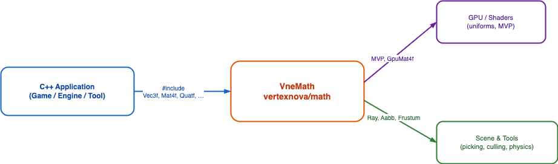
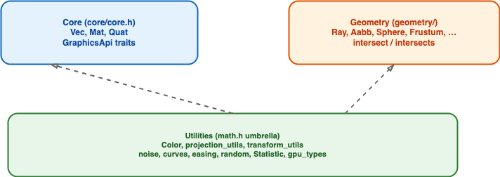
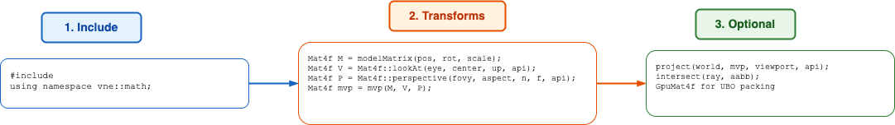

# VertexNova Math (vnemath)

## Overview

**vnemath** is a C++20 math library for real-time 3D: templated **vectors**, **matrices**, and **quaternions**; **geometry** primitives and ray intersection; **color** and interpolation helpers; and **graphics-API-aware** view and projection matrices (`GraphicsApi` for OpenGL, Vulkan, Metal, DirectX, WebGPU). It uses [GLM](https://github.com/g-truc/glm) under the hood for `float` / `double` fast paths.



**Figure 1: Context** — Application code includes `vertexnova/math/math.h` and uses types for shader uniforms (MVP, GPU-aligned structs), scene logic (picking, culling), and tools.

| Element | Description |
|---------|-------------|
| C++ Application | Engine, game, or tool code |
| VneMath | Headers under `include/vertexnova/math/` |
| GPU / Shaders | `Mat4f`, `GpuMat4f`, packed vectors for UBOs |
| Scene & Tools | `Ray`, `Aabb`, `Frustum`, `project` / `unproject`, etc. |

## Architecture

The library is organized in layers. The **umbrella** header `math.h` pulls in core types, geometry, color, animation/noise utilities, projection helpers, and optional **Statistic** / **GPU** layout types. For a smaller include surface, use **`core/core.h`** (Vec, Mat, Quat only) and add other headers as needed.



**Figure 2: Module layers**

| Layer | Contents |
|-------|----------|
| **Core** | `Vec`, `Mat`, `Quat`; `GraphicsApi` traits; `modelMatrix`, `mvp`, `viewProjection` |
| **Geometry** | `Ray`, `Aabb`, `Sphere`, `Triangle`, `Frustum`, `Plane`, `Obb`, `Capsule`, …; `intersect`, `intersects` |
| **Utilities** | `Color`, `projection_utils`, `transform_utils`, `viewport`, `TransformNode`, `noise`, `curves`, `easing`, `random`, `Statistic`, `gpu_types` |

## Key components

### Core types (`core/`)

- **`Vec<T, N>`** — `Vec2f`, `Vec3f`, `Vec4f`, integer and double aliases.
- **`Mat<T, R, C>`** — `Mat4f` for transforms and projection; `Mat3f` / `Mat2f` for linear algebra.
- **`Quat<T>`** — `Quatf`; rotation via `fromAxisAngle`, `slerp`, `toMatrix4`.
- **`GraphicsApi`** — Selects clip depth, NDC Y convention, and projection Y-flip (Vulkan) when building `perspective` / `lookAt`.

### Geometry (`geometry/`)

Volumes and primitives for collision, picking, and frustum culling. **`RayHit`** carries `distance`, `point`, `normal`, and optional **`uv`** (e.g. ray–triangle).

### Projection and screenspace (`projection_utils.h`, `viewport.h`)

- **`project`** / **`unproject`** — World ↔ pixel coordinates with API-correct Y.
- **`Viewport`** — Origin, width, height, depth range.

### Transforms (`transform_utils.h`, `core/core.h`)

- **`decompose`** / **`compose`** / **`lerpTransform`** — TRS round-trip and blended matrices.
- **`TransformNode`** — Minimal parent/child hierarchy with cached world matrix.

### Color (`color.h`)

RGBA in linear or sRGB; HSV / HSL factories; `toLinear` / `toSRGB`.

### GPU types (`gpu_types.h`)

Aligned `GpuVec3f`, `GpuMat4f`, etc., for std140 / std430 style buffers.

## Graphics API conventions (summary)

Always pass the same **`GraphicsApi`** to **`Mat4f::perspective`** and **`Mat4f::lookAt`** as your renderer. Vertical field of view for **`perspective`** is in **radians** (use **`degToRad`** for degrees). Vulkan’s NDC Y-down is handled via a projection Y-flip inside vnemath when `GraphicsApi::eVulkan` is selected.

See header comments in `core/types.h` for depth range, framebuffer origin, and handedness traits.

## Usage



**Figure 3: Typical usage flow**

| Step | Description |
|------|-------------|
| 1. Include | `#include <vertexnova/math/math.h>` and `using namespace vne::math;` (or qualify `vne::math::`) |
| 2. Transforms | Build model, view, projection; combine with **`mvp`** or manually $P \times V \times M$ |
| 3. Optional | **`project`** for picking; **`intersect`** for rays; **`Gpu*`** types for uniform buffers |

### Minimal example

```cpp
#include <vertexnova/math/math.h>

using namespace vne::math;

void example() {
    Vec3f eye(0.0f, 5.0f, 10.0f);
    Mat4f view = Mat4f::lookAt(eye, Vec3f::zero(), Vec3f::up(), GraphicsApi::eOpenGL);
    Mat4f proj = Mat4f::perspective(degToRad(45.0f), 16.0f / 9.0f, 0.1f, 100.0f, GraphicsApi::eOpenGL);
    Quatf rot = Quatf::identity();
    Mat4f model = modelMatrix(Vec3f::zero(), rot, 1.0f);
    Mat4f m = mvp(model, view, proj);

    Ray ray(Vec3f::zero(), Vec3f::forward());
    Aabb box(Vec3f(-1.0f), Vec3f(1.0f));
    if (intersects(ray, box)) {
        // ...
    }
}
```

## Examples and tests

Runnable examples live under `examples/` (e.g. transform decomposition, GPU alignment, noise). With tests enabled, CMake registers **`vnemath.test`** (command: **`TestVneMath`**). Run the suite with **`ctest --test-dir build`** instead of a hardcoded `bin/` path so single- and multi-config generators and Windows layouts work.

```bash
cmake -B build -DVNE_MATH_DEV=ON
cmake --build build
ctest --test-dir build
```

For multi-config generators, add the build configuration if needed, e.g. `ctest --test-dir build -C Release`.

## Requirements

- **C++20** or higher
- **GLM** (bundled under `deps/external/glm` or via FetchContent / find_package)

## Related documentation

- Repository **README.md** — build options, embedding as a submodule
- **Doxygen** — `cmake -DENABLE_DOXYGEN=ON -B build && cmake --build build --target vnemath_doc` for API HTML
- Diagram sources: [diagrams/README.md](diagrams/README.md)
